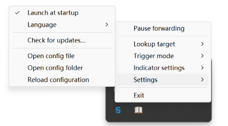

<h1 align="center">
  
  <span> SelectBridge</span>
</h1>

<p align="center">
  English | <a href="README.zh-CN.md">简体中文</a>
</p>

<p align="center">
  
</p>

SelectBridge is a lightweight desktop utility that forwards text selected in supported desktop applications to a configurable URL target. It runs as a native tray application on Windows and as a headless host on Windows, macOS, and Linux. The default target opens a GoldenDict-ng popup through `goldendict://`.

## Features

- Forward globally selected text to a configurable URL target.
- Monitor global selections through [selection-hook](https://github.com/0xfullex/selection-hook).
- Support immediate, modifier-key, custom-shortcut, icon, and dot trigger modes.
- Open a [GoldenDict-ng](https://github.com/xiaoyifang/goldendict-ng) popup or any custom URL template.
- Provide a lightweight Windows native tray host and a cross-platform headless host.
- Support Windows x64 and ARM64 Setup and Portable packages.
- Protect against duplicate selections, rapid repeats, and overlong text.

SelectBridge does not provide dictionaries or translation services. It forwards selected text to the target application or service you configure.

## Install

### Scoop

```powershell
scoop bucket add hoarfrost https://github.com/k4if3ng/hoarfrost
scoop install hoarfrost/select-bridge
```

Update an existing Scoop installation with:

```powershell
scoop update select-bridge
```

### Windows packages

Download the package for your architecture from [GitHub Releases](../../releases/latest)

## Usage

1. Start SelectBridge.
2. Select text in a supported desktop application.
3. SelectBridge forwards the text according to the configured trigger mode.

The default `immediate` mode forwards automatically. Modifier and custom-shortcut modes wait for the configured key combination. Windows native mode also supports floating `icon` and `dot` indicators with click or hover activation.

## Windows tray settings



The tray icon opens the same menu with either a left or right click. The first item changes between **Pause forwarding** and **Resume forwarding** according to the current state. Use the menu to select the lookup target, trigger mode, indicator size and activation, language, startup behavior, update checks, and configuration actions.

For the complete Windows behavior and troubleshooting details, see [Windows implementation](docs/WINDOWS.md).

## Custom URL templates

Open **Lookup target → Set URL template…** to configure another application or service. A template must:

- start with a valid URI scheme;
- contain exactly one `{text}` placeholder;
- contain no whitespace or control characters;
- be no longer than 2,048 characters.

Selected text replaces `{text}` after `encodeURIComponent` encoding. Saving a valid template immediately selects **Custom URL**.

## Configuration and updates

Configuration paths:

- Setup: `%APPDATA%\select-bridge\config.json`
- Portable: `<portable-directory>\data\config.json`
- Other platforms: `$XDG_CONFIG_HOME/select-bridge/config.json` or `~/.config/select-bridge/config.json`

Use `SELECT_BRIDGE_CONFIG` to select another configuration path. Select **Settings → Check for updates…** to compare the installed version with the latest stable GitHub Release. SelectBridge never downloads or installs updates automatically.

## Development

```shell
pnpm install
pnpm build
pnpm build:native
pnpm test
```

Run the cross-platform headless host with `pnpm start -- --host=headless`. Building the Windows native host additionally requires the matching Node.js architecture, Windows SDK, Visual Studio C++ tools, and Python available as `python`.

Technical documentation:

- [Architecture](docs/ARCHITECTURE.md)
- [Headless host](docs/HEADLESS.md)
- [Development](docs/DEVELOPMENT.md)
- [Windows implementation](docs/WINDOWS.md)

## Open-source acknowledgements

Global text-selection monitoring is powered by [selection-hook](https://github.com/0xfullex/selection-hook). The default lookup experience works with [GoldenDict-ng](https://github.com/xiaoyifang/goldendict-ng) through its `goldendict://` protocol. Thanks to these projects and their maintainers for making SelectBridge possible.

## Links

- [LINUX DO](https://linux.do/) — A community for developers and technology enthusiasts.

## License

[MIT](LICENSE)
