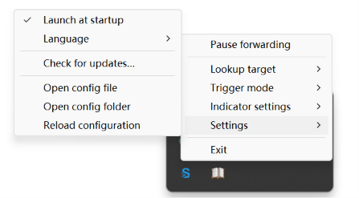

<h1 align="center">
  
  <span> SelectBridge</span>
</h1>

<p align="center">
  <a href="README.md">English</a> | 简体中文
</p>

<p align="center">
  
</p>

SelectBridge 是一个轻量的桌面工具，可将受支持的桌面应用中选中的文字转发到可配置的 URL 目标。Windows 使用原生系统托盘应用，Windows、macOS 和 Linux 也支持 headless 宿主。默认目标通过 `goldendict://` 打开 GoldenDict-ng 查询弹窗。

## 功能

- 将全局选中的文字转发到可配置的 URL 目标。
- 通过 [selection-hook](https://github.com/0xfullex/selection-hook) 监听全局文本选区。
- 支持暂停选区钩子，并从 Windows 托盘切换剪贴板回退。
- 支持立即、修饰键、自定义快捷键、图标和圆点触发方式。
- 支持打开 [GoldenDict-ng](https://github.com/xiaoyifang/goldendict-ng) 查询弹窗或任意自定义 URL 模板。
- 提供轻量的 Windows 原生托盘宿主和跨平台 headless 宿主。
- Windows x64 与 ARM64 均提供 Setup 和 Portable 包。
- 防止重复选区、快速连续触发和过长文本。

SelectBridge 本身不提供词典或翻译服务，只会将选中文本转发到你配置的目标应用或服务。

## 安装

### Scoop

```powershell
scoop bucket add hoarfrost https://github.com/k4if3ng/hoarfrost
scoop install hoarfrost/select-bridge
```

更新已有的 Scoop 安装：

```powershell
scoop update select-bridge
```

### Windows 发布包

从 [GitHub Releases](../../releases/latest) 下载与系统架构匹配的包

## 使用

1. 启动 SelectBridge。
2. 在受支持的桌面应用中选中文字。
3. SelectBridge 根据当前触发方式转发文本。

默认 `immediate` 模式会自动转发；修饰键和自定义快捷键模式等待配置的组合键。Windows native 模式还支持可点击或悬浮触发的 `icon` 和 `dot` 指示器。

## Windows 托盘设置



左键或右键点击托盘图标都会打开同一个菜单。菜单第一项会根据当前状态在“暂停转发”和“恢复转发”之间切换。菜单还可用于选择查询目标、触发方式、指示器大小和触发动作、界面语言、开机启动、更新检查及配置操作。

完整的 Windows 行为说明和排障信息见 [Windows 指南](docs/WINDOWS.md)。

## 自定义 URL 模板

通过“查询目标 → 设置 URL 模板…”配置其他应用或服务。模板必须：

- 以合法 URI scheme 开头；
- 必须且只能包含一个 `{text}`；
- 不包含空白或控制字符；
- 不超过 2048 个字符。

选中文本经过 `encodeURIComponent` 编码后替换 `{text}`。保存有效模板后会立即选中“自定义 URL”。

## 配置和更新

配置文件位置：

- 安装版：`%APPDATA%\select-bridge\config.json`
- Portable：`<便携目录>\data\config.json`
- 其他平台：`$XDG_CONFIG_HOME/select-bridge/config.json` 或 `~/.config/select-bridge/config.json`

可通过 `SELECT_BRIDGE_CONFIG` 指定其他配置路径。配置项 `enableClipboardFallback` 控制 selection-hook 是否允许在原生无障碍接口无法取词时发送模拟复制快捷键，默认值为 `true` 以保持兼容性，也可从 Windows 托盘切换。通过“设置 → 检查更新…”将当前安装版本与 GitHub 最新稳定版进行比较。SelectBridge 不会自动下载或安装更新。

## 常见问题

### 为什么在终端选词时会出现 `^C`，甚至中断当前命令？

剪贴板回退默认开启。当 Windows 无障碍接口无法读取选区时，它可能发送模拟 `Ctrl+C`；终端通常会把该组合解释为中断。取消勾选“设置 → 剪贴板回退”可以禁止模拟复制，但依赖剪贴板取词的应用可能不再产生选区。详细说明见 [Windows 常见问题](docs/WINDOWS.md#FAQ)。

## 开发

```shell
pnpm install
pnpm build
pnpm build:native
pnpm test
```

环境准备、原生构建、测试和打包见[开发说明](docs/DEVELOPMENT.md)。

文档：

- [架构](docs/ARCHITECTURE.md)
- [Headless 宿主](docs/HEADLESS.md)
- [开发说明](docs/DEVELOPMENT.md)
- [Windows 指南](docs/WINDOWS.md)
- [更新记录](CHANGELOG.md)

## 开源致谢

全局文本选区监听由 [selection-hook](https://github.com/0xfullex/selection-hook) 提供，默认查询体验则通过 [GoldenDict-ng](https://github.com/xiaoyifang/goldendict-ng) 的 `goldendict://` 协议实现。感谢这些项目及其维护者，让 SelectBridge 得以成为现实。

## 友情链接

- [LINUX DO](https://linux.do/) — 开发者与技术爱好者社区。

## 许可证

[MIT](LICENSE)
